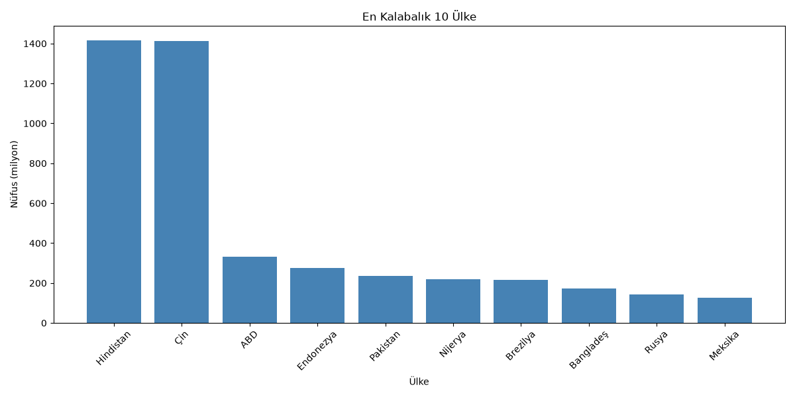

# Veri Analizi — Ülkeler

Pandas ile bir ülke veri seti üzerinde veri okuma, temizleme ve analiz çalışması. Gerçek dünya verisinin nasıl keşfedildiğini, kirli/eksik değerlerin nasıl temizlendiğini ve gruplama (groupby) ile nasıl özet çıkarıldığını gösterir.

## Kullanılan Teknolojiler

- Python
- Pandas (veri işleme ve analiz)
- Matplotlib (görselleştirme)

## Proje Yapısı

```
veri-analizi/
├── ulkeler.csv               # Ham ülke veri seti (nüfus, yüzölçümü, GSYİH, kıta, başkent)
├── temiz_ulkeler.csv         # Temizlenmiş veri (temizle.py'nin çıktısı)
├── temizle.py                # Keşif + temizlik + doğrulama, temiz_ulkeler.csv üretir
├── ulke_analiz.py            # Temiz veri üzerinde analiz (sıralama, gruplama)
├── gorsellestir.py           # Temiz veri üzerinde grafik oluşturma
├── ilk_pandas.py             # Pandas temelleri (DataFrame, filtreleme, sıralama)
├── en_kalabalik_ulkeler.png  # Üretilen grafik
└── README.md
```

Her dosyanın tek bir sorumluluğu vardır: `temizle.py` sadece temizler, `ulke_analiz.py` sadece analiz eder, `gorsellestir.py` sadece görselleştirir. Temizlik mantığı tek bir yerde tanımlıdır; diğer dosyalar doğrudan temizlenmiş veriyi (`temiz_ulkeler.csv`) okur.

## Kurulum

```
pip install pandas matplotlib
```

## Çalıştırma

Sırasıyla çalıştırın (temizlik önce yapılmalı, diğerleri temiz veriyi kullanır):

```
python temizle.py
python ulke_analiz.py
python gorsellestir.py
```

## Ne Yapıyor?

### 1. Keşif ve Temizlik (`temizle.py`)
Önce ham veri incelenir (`shape`, `info`, `isnull`) — hangi sütunlarda ne kadar eksik olduğu görülür. Gerçek veride iki tür kirlilik ele alınır:
- **Eksik veri** (boş hücreler): `isnull` ile tespit edilir
- **Hatalı veri** (dolu ama mantıksız, örneğin negatif nüfus): mantık kontrolüyle tespit edilir

Temizlik doğru sırayla yapılır:
1. Ülke adı (kimlik) eksik olan satırlar silinir — kurtarılamaz
2. Eksik sayısal değerler ortalama ile doldurulur (`fillna`) — böylece satır korunur
3. Eksik metin değerleri "Bilinmiyor" ile doldurulur
4. Hatalı (negatif nüfus) satırlar silinir

> Not: Sıra önemlidir. Önce doldurma, sonra silme yapılır; çünkü eksik (NaN) değerler
> sayısal karşılaştırmalarda beklenmedik şekilde elenebilir.

Temizlik sonrası tekrar `isnull().sum()` ile doğrulanır, sonuç `temiz_ulkeler.csv` olarak kaydedilir.

### 2. Analiz (`ulke_analiz.py`)
Temiz veri üzerinde çalışır:
- En kalabalık ülkeler (`sort_values`)
- Kıtaya göre ülke sayısı (`value_counts`)
- Kıtaya göre toplam nüfus (`groupby` + `sum`)

### 3. Görselleştirme (`gorsellestir.py`)
Temiz veri üzerinde çubuk grafik oluşturur:



Hindistan ve Çin, diğer ülkelerden belirgin şekilde ayrışıyor — dünya nüfusunun büyük kısmı bu iki ülkede yoğunlaşmış durumda.

## Öğrenilen Kavramlar

- DataFrame, Series
- Sütun seçme ve satır filtreleme
- Eksik ve hatalı veri tespiti/temizliği
- `fillna` ile eksik değer doldurma (imputation)
- `groupby` ile gruplama ve özetleme
- Method chaining (zincirleme işlemler)
- Matplotlib ile temel görselleştirme (çubuk grafik)
- Tek sorumluluk ilkesi: temizlik, analiz ve görselleştirmeyi ayrı dosyalara bölme